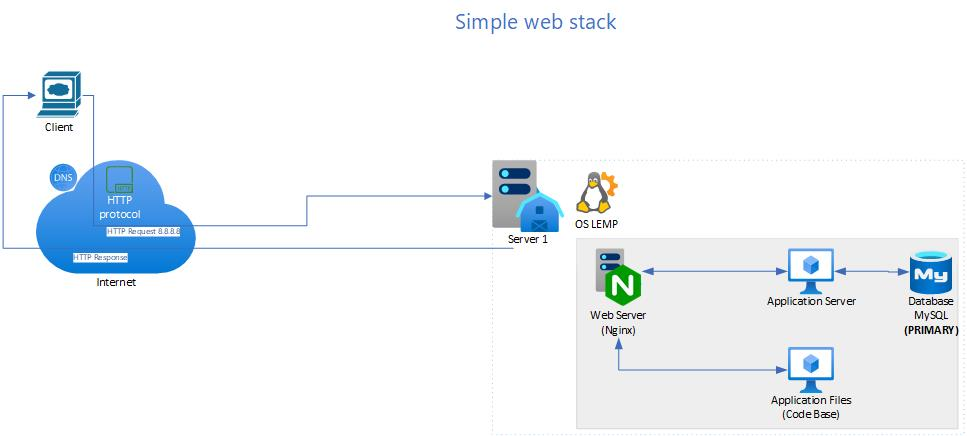

# Simple Web Stack

This file describes a simple web stack infrastructure with the following components:

## Infrastructure Components
- **1 server** running a LEMP stack.
- **Web server:** Nginx.
- **Application server:** Hosts application files (code base).
- **Database:** MySQL.
- **Domain name:** `foobar.com` configured with a `www` record pointing to IP `8.8.8.8`.

## Key Explanations:
1. **What is a server?**
   A server is a computer or system that provides services to other devices or users.

2. **What is the role of the domain name?**
   The domain name translates human-readable names (e.g., www.foobar.com) to IP addresses.

3. **What type of DNS record is `www` in `www.foobar.com`?**
   It is a CNAME or A record pointing to the IP address of the server.

4. **What is the role of the web server?**
   The web server (Nginx) serves static content and forwards requests to the application server.

5. **What is the role of the application server?**
   The application server processes business logic and executes application code.

6. **What is the role of the database?**
   The database stores data for the application.

7. **How does the server communicate with the user’s computer?**
   Communication happens via the HTTP protocol over the internet.

## Issues:
- **SPOF (Single Point of Failure):** If the single server fails, the website is inaccessible.
- **Downtime during maintenance:** The server must be restarted for updates or deployments.
- **Scaling limitations:** The single server cannot handle a surge in traffic.

