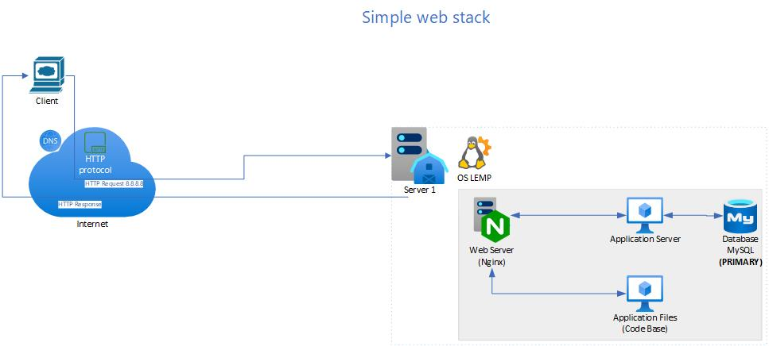
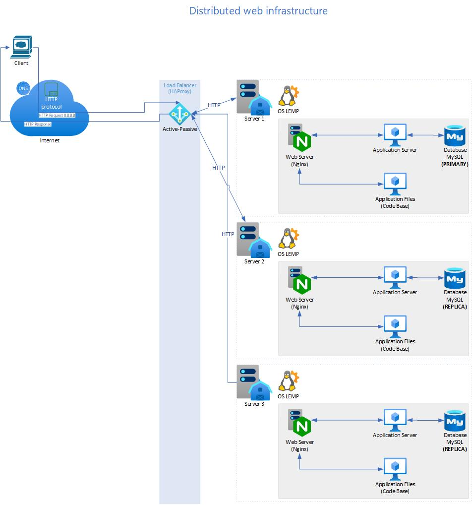
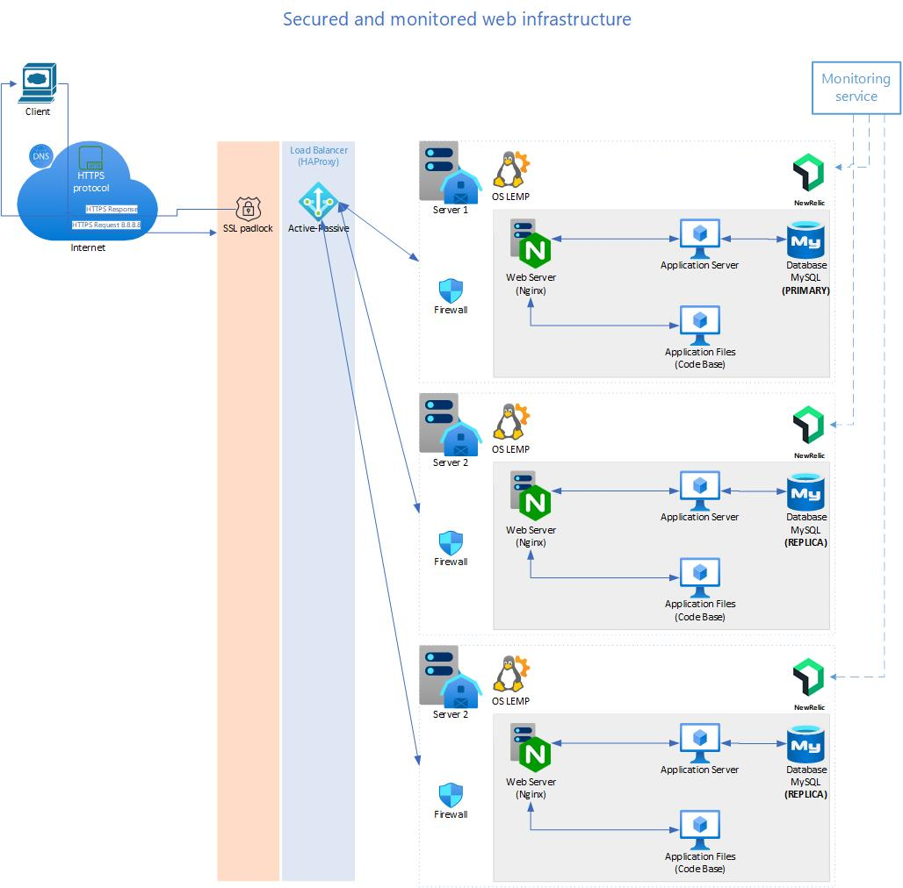
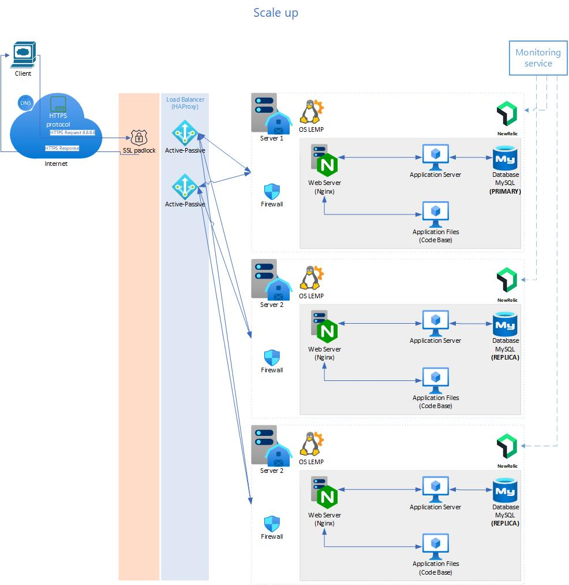

# ALX System Engineering DevOps: Web Infrastructure Design

This repository contains designs and explanations for web infrastructure setups, demonstrating key concepts such as single server architecture, distributed infrastructure, secured systems, and scaling strategies.

## Directory Structure

```
alx-system_engineering-devops/
└── 0x09-web_infrastructure_design/
    ├── diagrams/
    │   ├── 0-simple_web_stack.png
    │   ├── 1-distributed_web_infrastructure.png
    │   ├── 2-secured_and_monitored_web_infrastructure.png
    │   └── 3-scale_up.png
    ├── 0-simple_web_stack
    ├── 1-distributed_web_infrastructure
    ├── 2-secured_and_monitored_web_infrastructure
    └── 3-scale_up
```


## Tasks

### 0. Simple Web Stack

A basic one-server web infrastructure that uses:
- Nginx as a web server
- MySQL for the database
- Application code hosted on the same server

#### Diagram:


- [View file: `0-simple_web_stack`](./0-simple_web_stack)

---

### 1. Distributed Web Infrastructure

An infrastructure setup with:
- 3 servers for redundancy
- Load balancer (HAProxy) for traffic distribution
- Primary-Replica (Master-Slave) database cluster for scalability

#### Diagram:


- [View file: `1-distributed_web_infrastructure`](./1-distributed_web_infrastructure)

---

### 2. Secured and Monitored Web Infrastructure

A secured infrastructure that includes:
- Firewalls for enhanced security
- HTTPS enabled via SSL certificate
- Monitoring tools for performance tracking

#### Diagram:


- [View file: `2-secured_and_monitored_web_infrastructure`](./2-secured_and_monitored_web_infrastructure)

---

### 3. Scale Up

An infrastructure setup with:
- Additional server to handle scaling
- Load balancer cluster for high availability
- Components split across dedicated servers for improved performance

#### Diagram:


- [View file: `3-scale_up`](./3-scale_up)

---
